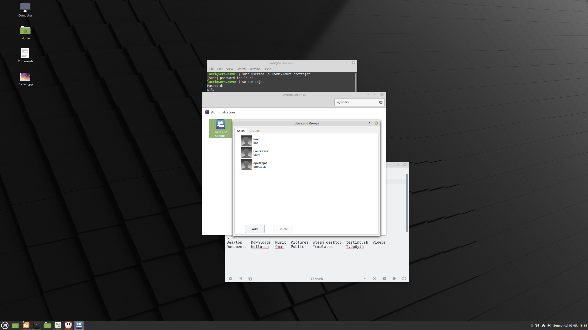

					Tehtävä 4.1

1.
Käyttäjän lisääminen:

lauri@Seravasvu:~$ sudo adduser opettaja
Adding user `opettaja' ...
Adding new group `opettaja' (1006) ...
Adding new user `opettaja' (1004) with group `opettaja' ...
Creating home directory `/home/opettaja' ...
Copying files from `/etc/skel' ...
New password: 
Retype new password: 
passwd: password updated successfully
Changing the user information for opettaja
Enter the new value, or press ENTER for the default
	Full Name []: opettaja
	Room Number []: 1
	Work Phone []: 
	Home Phone []: 
	Other []: 
Is the information correct? [Y/n] y

Käyttäjän vaihto:

lauri@Seravasvu:~$ su opettaja
Password: 

Kotihakemiston vaihtaminen:

lauri@Seravasvu:~$ sudo usermod -d /home/lauri opettaja
[sudo] password for lauri:     

lauri@Seravasvu:~$ su opettaja
Password: 

opettaja@Seravasvu:~$ ls
Desktop    Downloads  Music  Pictures  steam.desktop  testing.sh  Videos
Documents  hello.sh   Omat   Public    Templates      Työpöytä

opettaja@Seravasvu:~$ 

2.
Ryhmään lisääminen:

lauri@Seravasvu:~$ sudo usermod -a -G opettajat opettaja

lauri@Seravasvu:~$ 

lauri@Seravasvu:~$ sudo usermod -a -G opiskelijat opiskelija

lauri@Seravasvu:~$ 

3.
Kansioiden luonti ja oikeuksien asettaminen kullekin käyttäjälle sekä niiden testaus:

lauri@Seravasvu:~$ mkdir opiskelijoiden_tiedostot

lauri@Seravasvu:~$ mkdir opettajien_tiedostot

lauri@Seravasvu:~$ ls
Desktop    hello.sh  opettajien_tiedostot      Public         testing.sh
Documents  Music     opiskelijoiden_tiedostot  steam.desktop  Työpöytä
Downloads  Omat      Pictures                  Templates      Videos

lauri@Seravasvu:~$ sudo usermod -a -G sudo opettaja
[sudo] password for lauri:     

opettaja@Seravasvu:~$ sudo chmod 700 opettajien_tiedostot

opettaja@Seravasvu:~$ 
   
   
opettaja@Seravasvu:~$ sudo usermod -a -G sudo opiskelija

opettaja@Seravasvu:~$ 

opiskelija@Seravasvu:/home/lauri$ sudo chown -R opiskelija opiskelijoiden_tiedostot/

opiskelija@Seravasvu:/home/lauri$ sudo chmod 700 opiskelijoiden_tiedostot/

opiskelija@Seravasvu:/home/lauri$ 

opiskelija@Seravasvu:/home/lauri$ cd opiskelijoiden_tiedostot/

opiskelija@Seravasvu:/home/lauri/opiskelijoiden_tiedostot$ 

opiskelija@Seravasvu:/home/lauri/opiskelijoiden_tiedostot$ touch testi

opiskelija@Seravasvu:/home/lauri/opiskelijoiden_tiedostot$ ls
testi

opiskelija@Seravasvu:/home/lauri/opiskelijoiden_tiedostot$ su opettaja
Password: 
opettaja@Seravasvu:~/opiskelijoiden_tiedostot$ ls
ls: cannot open directory '.': Permission denied

opettaja@Seravasvu:~$ sudo chown -R opettaja opettajien_tiedostot/

opettaja@Seravasvu:~$ cd opettajien_tiedostot/

opettaja@Seravasvu:~/opettajien_tiedostot$ cd ..

opettaja@Seravasvu:~$ chmod 700 opettajien_tiedostot/

opettaja@Seravasvu:~$ cd opettajien_tiedostot/

opettaja@Seravasvu:~/opettajien_tiedostot$ touch testi

opettaja@Seravasvu:~/opettajien_tiedostot$ ls
testi

opettaja@Seravasvu:~/opettajien_tiedostot$ su lauri
Password: 

lauri@Seravasvu:~/opettajien_tiedostot$ ls
ls: cannot open directory '.': Permission denied

4.
Käyttäjien lukitseminen:

lauri@Seravasvu:~/opettajien_tiedostot$ sudo usermod -L opettaja
[sudo] password for lauri:     

lauri@Seravasvu:~/opettajien_tiedostot$ sudo usermod -L opiskelija

lauri@Seravasvu:~/opettajien_tiedostot$ su opiskelija
Password: 
ls
su: Authentication failure

Näin saan käyttöoikeudet takaisin:

lauri@Seravasvu:~/opettajien_tiedostot$ sudo passwd -u opettaja
passwd: password expiry information changed.

lauri@Seravasvu:~/opettajien_tiedostot$ su opettaja
Password: 

opettaja@Seravasvu:~/opettajien_tiedostot$ 

Tein saman opiskelijalle:

opettaja@Seravasvu:~/opettajien_tiedostot$ sudo passwd -u opiskelija
passwd: password expiry information changed.

opettaja@Seravasvu:~/opettajien_tiedostot$ su opiskelija
Password: 

opiskelija@Seravasvu:/home/lauri/opettajien_tiedostot$ 

Käyttäjänhallinta gui-ympäristössä:

