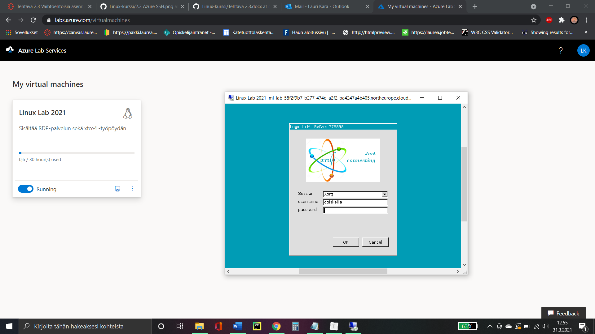

Tehtävä 2.3

Asensin Linuxin USB-tikulta tietokoneelle rinnakkaiseksi käyttöjärjestelmäksi. Käytin asentamisessa Rufusta, toteutin asennuksen tavallisella 8gb muistitikulla. 

 

Latasin netistä Linux Mint -levykuvan sekä Rufuksen. Kirjoitin levykuvan USB-tikulle Rufuksella. Tässä vaiheessa Windows ilmoitti että en omaa käyttöoikeuksia tikkuun, ratkaisin ongelman pikaisen Google-haun avulla. 

 

Käynnistin tietokoneen uudestaan ja valitsin käynnistyslaitteeksi USB-tikun. Tämän jälkeen Linux Mint -asennus näkyi ruudulla. Asensin käyttöjärjestelmän ruudulla näkyvien ohjeiden mukaisesti valittuani asennussijainniksi vapauttamani levytilan. Kirjoitin tämän tehtävän LibreOffice Writerillä asentamassani Linux Mint -käyttöjärjestelmässä. 

Muutin tehtävän vielä markdown-muotoon tämän jälkeen toisella tietokoneella.

 

Käyttöjärjestelmäksi valitsin Linux Mintin sillä se on mielestäni monikäyttöinen ja aloittelijaystävällinen Linux-jakelupaketti. Käyttöjärjestelmässä on hyvää myös nopea toimivuus ilman isompia muutoksia ensimmäistä kertaa käynnistettäessä.

 

Kokeilin myös käyttää Linuxia onnistuneesti kannettavalla tietokoneella samalla USB-tikulla.

A) Linux Azure-pilvessä

Azure RDP-yhteydellä.

Azure SSH-yhteydellä

B) Linux USB-tikulle

Linux suoraan USB-tikulta ilman asennusta

C) Linuxin asentaminen Windowsin rinnalle

Linux Mint rinnakkaisasennettuna pöytäkoneelle (dual boot)

